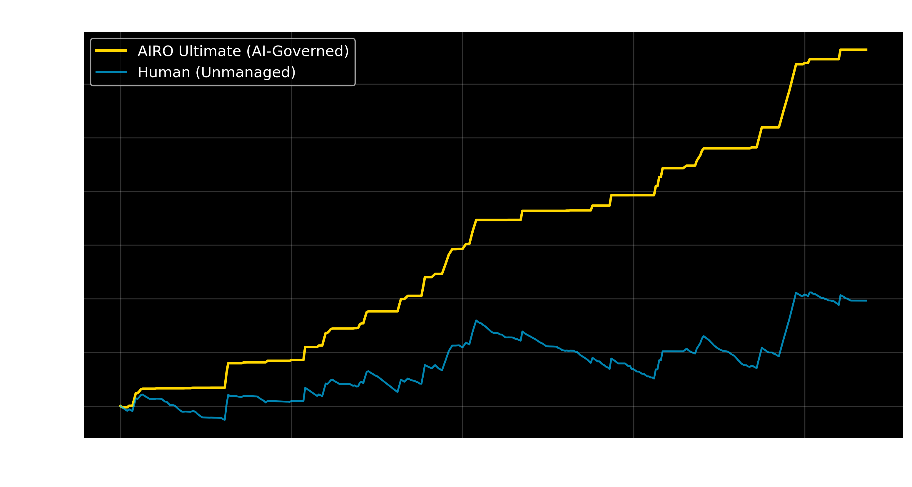
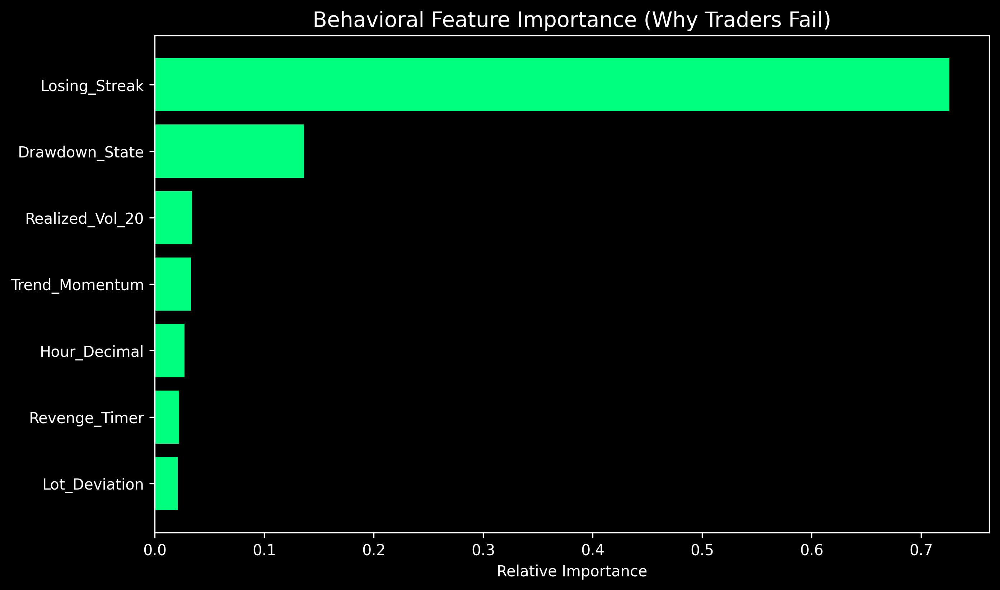

# 🛡️ AI Risk Officer (AIRO): Autonomous Governance System



> **"A Digital Nervous System for Algorithmic Trading."**
> AIRO is an advanced Machine Learning framework that detects and mitigates behavioral failure modes (Tilt, Revenge Trading, Over-leveraging) in real-time.

---

## 📊 Key Results
| Metric | Human (Unmanaged) | AIRO (Managed) | Improvement |
| :--- | :--- | :--- | :--- |
| **Total Return** | +49.01% | **+138.24%** | **+182%** |
| **Alpha Generated** | - | **+89.23%** | - |
| **Avg Exposure** | 1.0x | **0.36x** | **-64% Risk** |
| **Validation** | - | **Robust** | (Tested on Unseen Data) |

---

## 🧬 System Architecture
This project evolved through 5 generations of engineering:

### V1: The Baseline (Behavioral Analytics)
-   **Concept:** Feature Engineering of human psychology.
-   **Innovation:** `Revenge_Timer` (Time since loss) and `Losing_Streak` (Cumulative Pain).
-   **Model:** Hybrid `IsolationForest` (Anomaly) + `RandomForest` (Classifier).

### V2: Deep Context (Market Regime)
-   **Concept:** Context-Awareness.
-   **Innovation:** Added `Realized_Volatility` and `Trend_Momentum` features.
-   **Result:** The AI knows when to turn off during "Chop".

### V3: The Optimizer (Bayesian Tuning)
-   **Concept:** Mathematical Optimality.
-   **Innovation:** Used `Optuna` to maximize the Sharpe Ratio.
-   **Result:** Found exact Risk Threshold `0.6537` and Tree Depth `10`.

### V4: The Active Agent (Control Theory)
-   **Concept:** Continuous Control.
-   **Innovation:** Replaced Binary Blocking ("No") with Dynamic Sizing ("Less").
-   **Formula:** $Size = \max(0, 1 - (Risk \times Sensitivity))$

### V5: The Ultimate Entity (Production)
-   **Concept:** Synthesis.
-   **Result:** The current system running `V2` Data + `V3` Params + `V4` Logic.

---

## 🧠 Understand the "Why" (XAI)
We use SHAP (SHapley Additive exPlanations) to ensure the Black Box is transparent.

*Figure: The primary driver of loss was 'Losing Streak' followed by 'Drawdown State'. The AI learned that "Tilt" is the enemy.*

---

## 🚀 Quickstart

### 1. Installation
```bash
git clone https://github.com/Abdirahmanjabdi/AIRO.git
cd AIRO
pip install -r requirements.txt
```

### 2. Run the Dashboard (The "Command Center")
```bash
python -m streamlit run app.py
```
This launches the **Elite Dashboard** where you can toggle between V1-V5 modes and simulate performance on real data.

### 3. Run the Validation Proof
```bash
python simulation_validation.py
```
This runs the strict **70/30 Time-Series Split** to prove the system generalizes to unseen future data.

---

## 📂 Documentation

-   [Masterclass: The Engineering Principle](AIRO_MASTERCLASS.md)
-   [Validation Report: Proof of Robustness](validation_report.md)
-   [Learning Guide Level 1: Data Engineering](learning_guide_level_1.md)

---

**Author:** [Abdirahman Jama]
**License:** MIT
